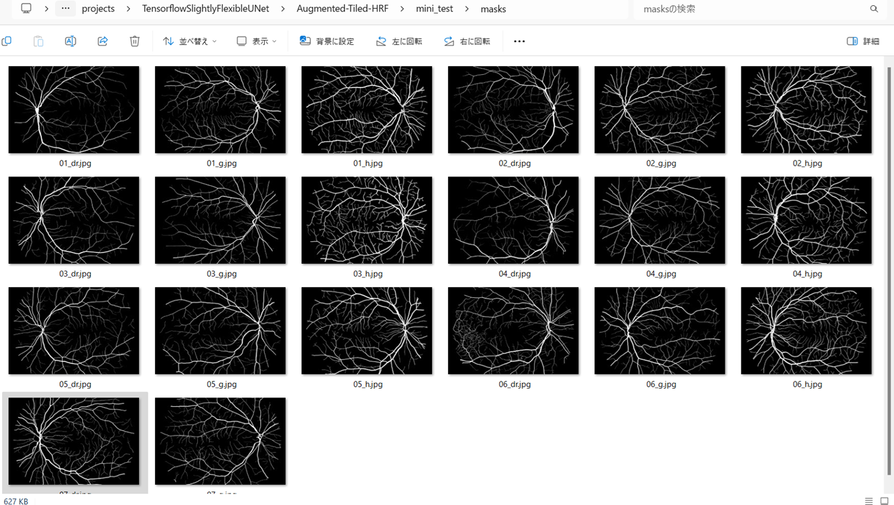
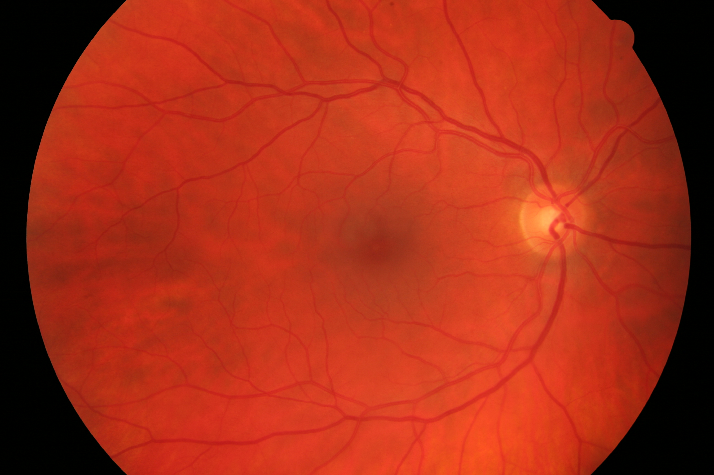

<h2>Tensorflow-Tiled-Image-Segmentation-Pre-Augmented-HRF-Retinal-Vessel (2025/02/09)</h2>

This is the first experiment of Tiled Image Segmentation for <b>HRF Retinal Vessel</b>
 based on 
the latest <a href="https://github.com/sarah-antillia/Tensorflow-Image-Segmentation-API">Tensorflow-Image-Segmentation-API</a>, 
and a <b>pre-augmented tiled dataset</b> <a href="https://drive.google.com/file/d/1bCbZRej3_aOaYuvXbv0vYnrPold3aXPf/view?usp=sharing">
Augmented-Tiled-HRF-ImageMask-Dataset.zip</a>, which was derived by us from the following dataset:  
<a href="https://www5.cs.fau.de/fileadmin/research/datasets/fundus-images/all.zip">
Download the whole dataset (~73 Mb)</a> in <a href="https://www5.cs.fau.de/research/data/fundus-images/"><b>High-Resolution Fundus (HRF) Image Database</b></a>.
 
 

Please see also our experiments: 
<li>
<a href="https://github.com/sarah-antillia/Tensorlfow-Tiled-Image-Segmentation-Pre-Augmented-DRIVE-Retinal-Vessel">
Tensorflow-Tiled-Image-Segmentation-Pre-Augmented-DRIVE-Retinal-Vessel</a> based on 
<a href="https://drive.grand-challenge.org/">DRIVE: Digital Retinal Images for Vessel Extraction</a>
</li>
<li>
<a href="https://github.com/sarah-antillia/Tensorflow-Tiled-Image-Segmentation-Pre-Augmented-STARE-Retinal-Vessel">
Tensorflow-Tiled-Image-Segmentation-Pre-Augmented-STARE-Retinal-Vessel</a> baased on 
<a href="https://cecas.clemson.edu/~ahoover/stare/">STructured Analysis of the Retina</a>.
 
</li>
<li>
<a href="https://github.com/sarah-antillia/Tensorflow-Image-Segmentation-Retinal-Vessel">
Tensorflow-Image-Segmentation-Retinal-Vessel</a> based on <a href="https://researchdata.kingston.ac.uk/96/">CHASE_DB1 dataset</a>.
</li>
 

<b>Experiment Strategies</b> 
As demonstrated in our experiments 
<a href="https://github.com/sarah-antillia/Tensorflow-Tiled-Image-Segmentation-Pre-Augmented-STARE-Retinal-Vessel">
Tensorflow-Tiled-Image-Segmentation-Pre-Augmented-STARE-Retinal-Vessel</a>
 and 
<a href="https://github.com/sarah-antillia/Tensorflow-Tiled-Image-Segmentation-IDRiD-HardExudates">
Tensorflow-Tiled-Image-Segmentation-IDRiD-HardExudates </a>, 
the Tiled Image Segmentation based on a simple UNet model trained by a tiledly-splitted images and masks dataset, 
is an effective method for the large image segmentation over 3K pixels.
Furthermore, as mentioned in 
<a href="https://github.com/sarah-antillia/Tensorflow-Tiled-Image-Segmentation-Pre-Augmented-STARE-Retinal-Vessel">
Tensorflow-Tiled-Image-Segmentation-Pre-Augmented-STARE-Retinal-Vessel</a>,  
it is difficult to precisely segment retinal blood vessels in small images using a simple UNet model 
because these vessels are typically very thin. However, the image size of HRF is 3504x2336 pixels and large enough 
for our segmetation model without upscaling.
 
 
In this experiment, we employed the similar strategies in this project as we did in the 
<a href="https://github.com/sarah-antillia/Tensorflow-Tiled-Image-Segmentation-Pre-Augmented-STARE-Retinal-Vessel">
STARE-Retinal-Vessel</a>.
 
<b>1. Pre Augemtned Tiled HRF ImageMask Dataset</b> 
We generated a pre-augmented image mask dataset from the original 3504x2336 pixels high resolution dataset, which was tiledly-splitted to 512x512 pixels 
and reduced to 512x512 pixels image and mask dataset.
 
 
<b>2. Train Segmention Model </b> 
We trained and validated a TensorFlow UNet model by using the <b>Pre Augmented Tiled HRF ImageMask Dataset</b>
 
 
<b>3. Tiled Image Segmentation</b> 
We applied our Tiled-Image Segmentation inference method to predict the HRF Retinal Vessel for the mini_test images 
with a resolution of 3390x3504 pixels of the Enlarged Dataset.  

<b>Actual Tiled Image Segmentation for Images of 3504x2336 pixels</b> 
As shown below, the inferred masks look similar to the ground truth masks.  

<table>
<tr>
<th>Input: image</th>
<th>Mask (ground_truth)</th>
<th>Prediction: inferred_mask</th>
</tr>
<tr>
<td></td>
<td></td>
<td></td>
</tr>

<tr>
<td></td>
<td></td>
<td></td>
</tr>

<tr>
<td></td>
<td></td>
<td></td>
</tr>

</table>

 
In this experiment, we used the simple UNet Model 
<a href="./src/TensorflowUNet.py">TensorflowSlightlyFlexibleUNet</a> for this HRFSegmentation Model. 
As shown in <a href="https://github.com/sarah-antillia/Tensorflow-Image-Segmentation-API">Tensorflow-Image-Segmentation-API</a>.
you may try other Tensorflow UNet Models: 

<li><a href="./src/TensorflowSwinUNet.py">TensorflowSwinUNet.py</a></li>
<li><a href="./src/TensorflowMultiResUNet.py">TensorflowMultiResUNet.py</a></li>
<li><a href="./src/TensorflowAttentionUNet.py">TensorflowAttentionUNet.py</a></li>
<li><a href="./src/TensorflowEfficientUNet.py">TensorflowEfficientUNet.py</a></li>
<li><a href="./src/TensorflowUNet3Plus.py">TensorflowUNet3Plus.py</a></li>
<li><a href="./src/TensorflowDeepLabV3Plus.py">TensorflowDeepLabV3Plus.py</a></li>
 

<h3>1. Dataset Citation</h3>
The dataset used here has been taken from the dataset 
<a href="https://www5.cs.fau.de/fileadmin/research/datasets/fundus-images/all.zip">
Download the whole dataset (~73 Mb)</a> in <a href="https://www5.cs.fau.de/research/data/fundus-images/"><b>High-Resolution Fundus (HRF) Image Database</b></a>.
  
<b>Introduction</b> 
This database has been established by a collaborative research group to support comparative studies on 
automatic segmentation algorithms on retinal fundus images. The database will be 
iteratively extended and the webpage will be improved. 
We would like to help researchers in the evaluation of segmentation algorithms. 
We encourage anyone working with segmentation algorithms who found our database useful to send us 
their evaluation results with a reference to a paper where it is described. This way we can extend our database of algorithms with the given results to keep it always up-to-date.
 
The database can be used freely for research purposes. We release it under Creative Commons 4.0 Attribution License. 
  
<b>Citation</b> 
<a href="https://onlinelibrary.wiley.com/doi/10.1155/2013/154860">
<b>Robust Vessel Segmentation in Fundus Images</b></a>
 
Budai, Attila; Bock, Rüdiger; Maier, Andreas; Hornegger, Joachim; Michelson, Georg. 
<b>
International Journal of Biomedical Imaging, vol. 2013, 2013</b>
 
 

<b>Licence</b> 
<a href="https://creativecommons.org/licenses/by/4.0/">Creative Commons 4.0 Attribution License.</a>
 
 
<h3>
<a id="2">
2 Augmented-Tiled-HRF ImageMask Dataset
</a>
</h3>
 If you would like to train this HRF Segmentation model by yourself,
 please download the pre-augmented dataset from the google drive  
<a href="https://drive.google.com/file/d/1bCbZRej3_aOaYuvXbv0vYnrPold3aXPf/view?usp=sharing">
Augmented-Tiled-HRF-ImageMask-Dataset.zip</a>,
 expand the downloaded ImageMaskDataset and put it under <b>./dataset</b> folder to be
<pre>
./dataset
└─Augmented-Tiled-HRF
    ├─test
    │   ├─images
    │   └─masks
    ├─train
    │   ├─images
    │   └─masks
    └─valid
        ├─images
        └─masks
</pre>
This is a 512x512 pixels pre augmented tiles dataset generated from 3504x2336 pixels 40 images and
their corresponding masks. 
. 

The folder structure of the original <b>HRF/all</b> dataset is the following. 

<pre>
./HRF
└─all
    ├─images
    │   ├─01_dr.JPG
    │   ├─01_g.jpg
    │   ├─01_h.jpg
     ...    
    │   └─15_h.jpg
    └─manual1
        ├─01_dr.tif
        ├─01_g.tif
        ├─01_h.tif
         ...
        └─15_h.tif
</pre>
We excluded all black (empty) masks and their corresponding images to generate our dataset from the original HRF.   
On the derivation of the dataset, please refer to the following Python scripts. 
<li><a href="./generator/TiledImageMaskDatasetGenerator.py">TiledImageMaskDatasetGenerator.py</a></li>
<li><a href="./generator/split_tiled_master.py">split_tiled_master.py</a></li>
 
 
<b>Augmented-Tiled-HRF Statistics</b> 
 
 
As shown above, the number of images of train and valid datasets is enough 
to use for a training set of our segmentation model.
 
 
<b>Train_images_sample</b> 

 
<b>Train_masks_sample</b> 

 
<h3>
3 Train TensorflowUNet Model
</h3>
 We have trained HRF TensorflowUNet Model by using the following
<a href="./projects/TensorflowSlightlyFlexibleUNet/Augmented-Tiled-HRF/train_eval_infer.config"> <b>train_eval_infer.config</b></a> file.  
Please move to ./projects/TensorflowSlightlyFlexibleUNet/Augmented-Tiled-HRF and run the following bat file. 
<pre>
>1.train.bat
</pre>
, which simply runs the following command. 
<pre>
>python ../../../src/TensorflowUNetTrainer.py ./train_eval_infer.config
</pre>

<b>Model parameters</b> 
Enabled Batch Normalization. 
Defined a small <b>base_filters=16</b> and large <b>base_kernels=(9,9)</b> for the first Conv Layer of Encoder Block of 
<a href="./src/TensorflowUNet.py">TensorflowUNet.py</a> 
and a large num_layers (including a bridge between Encoder and Decoder Blocks).
<pre>
[model]
base_filters   = 16
base_kernels   = (9,9)
num_layers     = 8
dilation       = (3,3)
</pre>

<b>Learning rate</b> 
Defined a small learning rate.  
<pre>
[model]
learning_rate  = 0.00007
</pre>

<b>Online augmentation</b> 
Disabled our online augmentation tool. 
<pre>
[model]
model         = "TensorflowUNet"
generator     = False
</pre>

<b>Loss and metrics functions</b> 
Specified "bce_dice_loss" and "dice_coef". 
<pre>
[model]
loss           = "bce_dice_loss"
metrics        = ["dice_coef"]
</pre>
<b >Learning rate reducer callback</b> 
Enabled learing_rate_reducer callback, and a small reducer_patience.
<pre> 
[train]
learning_rate_reducer = True
reducer_factor     = 0.4
reducer_patience   = 4
</pre>

<b>Dataset class</b> 
Specified ImageMaskDataset class.
<pre>
[dataset]
datasetclass  = "ImageMaskDataset"
resize_interpolation = "cv2.INTER_LINEAR"
</pre>

<b>Early stopping callback</b> 
Enabled early stopping callback with patience parameter.
<pre>
[train]
patience      = 10
</pre>

<b>Tiled inference</b> 
We used 3504x2336 pixels JPG images and masks of the original HRF dataset as a mini_test dataset for our TiledInference.
<pre>
[tiledinfer] 
overlapping   = 64
images_dir    = "./mini_test/images"
output_dir    = "./mini_test_output_tiled"
</pre>

<b>Epoch change inference callbacks</b> 
Enabled epoch_change_infer callback. 
<pre>
[train]
epoch_change_infer      = False
epoch_change_infer_dir  = "./epoch_change_infer"
epoch_change_tiledinfer = True
epoch_change_tiledinfer_dir = "./epoch_change_tiledinfer"
num_infer_images       = 6
</pre>

By using this callback, on every epoch_change, the epoch change tiledinfer procedure can be called
 for 6 images in <b>mini_test</b> folder. This will help you confirm how the predicted mask changes 
 at each epoch during your training process.    

<b>Epoch_change_inference output at starting (1,2,3)</b> 
 
 
 
<b>Epoch_change_inference output at ending (90,91,92)</b> 
 
 
 

In this experiment, the training process was stopped at epoch 92 by EarlyStopping Callback.  
 
 

<a href="./projects/TensorflowSlightlyFlexibleUNet/Augmented-Tiled-HRF/eval/train_metrics.csv">train_metrics.csv</a> 
 

 
<a href="./projects/TensorflowSlightlyFlexibleUNet/Augmented-Tiled-HRF/eval/train_losses.csv">train_losses.csv</a> 
 

 

<h3>
4 Evaluation
</h3>
Please move to a <b>./projects/TensorflowSlightlyFlexibleUNet/Augmented-Tiled-HRF</b> folder, 
and run the following bat file to evaluate TensorflowUNet model for HRF. 
<pre>
./2.evaluate.bat
</pre>
This bat file simply runs the following command.
<pre>
python ../../../src/TensorflowUNetEvaluator.py ./train_eval_infer_aug.config
</pre>

Evaluation console output: 

  Image-Segmentation-HRF

<a href="./projects/TensorflowSlightlyFlexibleUNet/Augmented-Tiled-HRF/evaluation.csv">evaluation.csv</a> 

The loss (bce_dice_loss) to this Augmented-Tiled-HRF/test was not low, and dice_coef not high as shown below.
 
<pre>
loss,0.173
dice_coef,0.784
</pre>
 

<h3>
5 Tiled inference
</h3>
Please move to a <b>./projects/TensorflowSlightlyFlexibleUNet/Augmented-Tiled-HRF</b> folder 
,and run the following bat file to infer segmentation regions for images by the Trained-TensorflowUNet model for HRF. 
<pre>
./4.tiled_infer.bat
</pre>
This simply runs the following command.
<pre>
python ../../../src/TensorflowUNetTiledInferencer.py ./train_eval_infer.config
</pre>

<b>mini_test_images (3504x2336 pixels)</b> 
 
<b>mini_test_mask(ground_truth)</b> 
 

<b>Tiled inferred test masks (3504x2336  pixels)</b> 
 
 

<b>Enlarged images and masks of 3504x2336  pixels</b> 

<table>
<tr>
<th>Image</th>
<th>Mask (ground_truth)</th>
<th>Tiled-inferred-mask</th>
</tr>

<tr>
<td></td>
<td></td>
<td></td>
</tr>
<tr>
<td></td>
<td></td>
<td></td>
</tr>
<tr>
<td></td>
<td></td>
<td></td>
</tr>
<tr>
<td></td>
<td></td>
<td></td>
</tr>
<tr>
<td></td>
<td></td>
<td></td>
</tr>
<tr>
<td></td>
<td></td>
<td></td>
</tr>

</table>

 

<h3>
References
</h3>
<b>1. Locating Blood Vessels in Retinal Images by Piecewise Threshold Probing of a Matched Filter Response</b> 
Adam Hoover, Valentina Kouznetsova, and Michael Goldbaum 
<a href="https://www.uhu.es/retinopathy/General/000301IEEETransMedImag.pdf">
https://www.uhu.es/retinopathy/General/000301IEEETransMedImag.pdf
</a>
 
 
<b>2. High-Resolution Fundus (HRF) Image Database</b> 
Budai, Attila; Bock, Rüdiger; Maier, Andreas; Hornegger, Joachim; Michelson, Georg. 
<a href="https://www5.cs.fau.de/research/data/fundus-images/">
https://www5.cs.fau.de/research/data/fundus-images/
</a>.
 
 
<b>3. Robust Vessel Segmentation in Fundus Images</b> 
Budai, Attila; Bock, Rüdiger; Maier, Andreas; Hornegger, Joachim; Michelson, Georg. 

<a href="https://onlinelibrary.wiley.com/doi/10.1155/2013/154860">
https://onlinelibrary.wiley.com/doi/10.1155/2013/154860
</a>
 
 
<b>4. State-of-the-art retinal vessel segmentation with minimalistic models</b> 
Adrian Galdran, André Anjos, José Dolz, Hadi Chakor, Hervé Lombaert & Ismail Ben Ayed 
<a href="https://www.nature.com/articles/s41598-022-09675-y">
https://www.nature.com/articles/s41598-022-09675-y
</a>
 
 
<b>5. Retinal blood vessel segmentation using a deep learning method based on modified U-NET model</b> 
Sanjeewani, Arun Kumar Yadav, Mohd Akbar, Mohit Kumar, Divakar Yadav 
<a href="https://www.semanticscholar.org/reader/f5cb3b1c69a2a7e97d1935be9d706017af8cc1a3">
https://www.semanticscholar.org/reader/f5cb3b1c69a2a7e97d1935be9d706017af8cc1a3</a>
 
 
<b>6. Tensorflow-Tiled-Image-Segmentation-Pre-Augmented-STARE-Retinal-Vessel</b> 
Toshiyuki Arai @antillia.com 
<a href="https://github.com/sarah-antillia/Tensorflow-Tiled-Image-Segmentation-Pre-Augmented-STARE-Retinal-Vessel">
https://github.com/sarah-antillia/Tensorflow-Tiled-Image-Segmentation-Pre-Augmented-STARE-Retinal-Vessel</a>
 
 
<b>7, Tensorflow-Image-Segmentation-Retinal-Vessel</b> 
Toshiyuki Arai @antillia.com 
<a href="https://github.com/sarah-antillia/Tensorflow-Image-Segmentation-Retinal-Vessel">
https://github.com/sarah-antillia/Tensorflow-Image-Segmentation-Retinal-Vessel</a>
 
 
<b>8. Tensorflow-Tiled-Image-Segmentation-Augmented-Skin-Cancer</b> 
Toshiyuki Arai @antillia.com 
<a href="https://github.com/sarah-antillia/Tensorflow-Tiled-Image-Segmentation-Augmented-Skin-Cancer">
https://github.com/sarah-antillia/Tensorflow-Tiled-Image-Segmentation-Augmented-Skin-Cancer
</a>
 
 
<b>9. Tensorflow-Tiled-Image-Segmentation-Augmented-MultipleMyeloma</b> 
Toshiyuki Arai @antillia.com 
<a href="https://github.com/sarah-antillia/Tensorflow-Tiled-Image-Segmentation-Augmented-MultipleMyeloma">
https://github.com/sarah-antillia/Tensorflow-Tiled-Image-Segmentation-Augmented-MultipleMyeloma
</a>
 
 
<b>10. Tiled-ImageMask-Dataset-Breast-Cancer</b> 
Toshiyuki Arai @antillia.com 
<a href="https://github.com/sarah-antillia/Tiled-ImageMask-Dataset-Breast-Cancer">
https://github.com/sarah-antillia/Tiled-ImageMask-Dataset-Breast-Cancer
</a>
 
 

